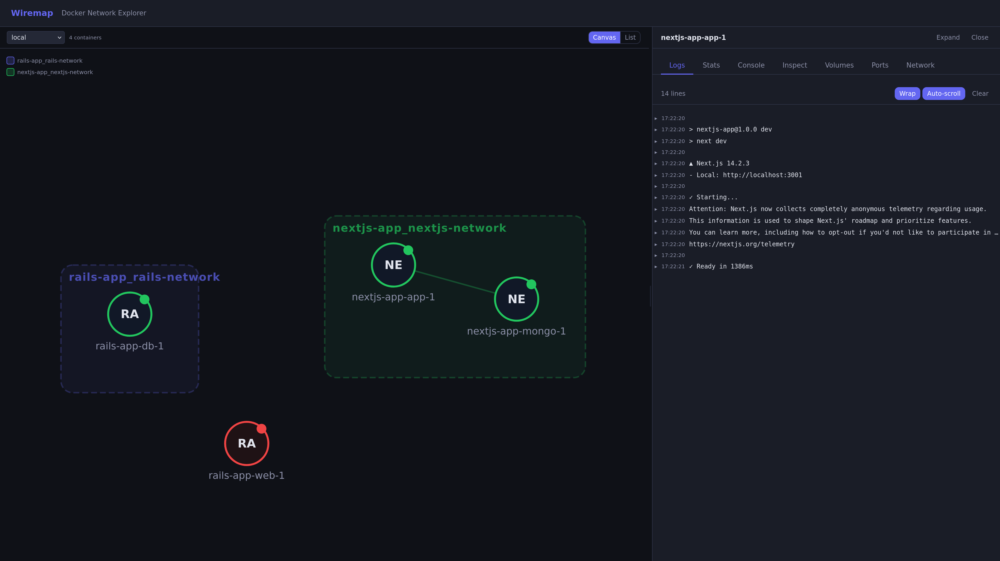

# Wiremap

A self-hosted visual Docker network topology explorer. Single binary, zero dependencies.

Wiremap gives you an interactive network map of your Docker containers with real-time log streaming, live stats, an embedded terminal, a file browser with editor, and full container inspection.

[](LICENSE)


<!-- Screenshot placeholder: replace the path below with an actual screenshot -->
<p align="center">
  
</p>

## Install

### One-liner

```bash
curl -sSL https://raw.githubusercontent.com/codeofmario/wiremap/main/install.sh | sh
```

### Docker

```bash
docker run -d \
  -p 8080:8080 \
  -v /var/run/docker.sock:/var/run/docker.sock:ro \
  codeofmario/wiremap
```

### Docker Compose

```yaml
services:
  wiremap:
    image: codeofmario/wiremap
    ports:
      - "8080:8080"
    volumes:
      - /var/run/docker.sock:/var/run/docker.sock:ro
    restart: unless-stopped
```

### From source

```bash
git clone https://github.com/codeofmario/wiremap.git
cd wiremap
make build
./bin/wiremap
```

Open [http://localhost:8080](http://localhost:8080).

## Features

- **Network Topology Canvas** — Interactive D3.js force-directed graph showing containers grouped by Docker network with zoom, pan, and drag. Optimized layout with collision avoidance to prevent overlapping nodes and labels
- **List View** — Collapsible container list grouped by network with status indicators, text search (by name or image), and state filtering (all/running/exited)
- **Real-time Logs** — Streaming log output with timestamp parsing, log level detection (error/warn/info/debug), and color coding
- **Live Stats** — CPU, memory, and network I/O charts updated in real-time
- **Container Console** — Interactive shell (xterm.js) via `docker exec`
- **Container Inspection** — Environment variables (with secret masking), image, command, entrypoint, labels, restart policy, health status
- **Editable Environment Variables** — Edit env vars in the UI and apply (recreates the container)
- **Volume Browser** — Navigate container filesystem, view and edit files with Monaco Editor and syntax highlighting for 20+ languages
- **Port & Network Details** — Port mappings, bind mounts, named volumes, network IPs, and DNS aliases
- **Multi-Host Support** — Connect to multiple Docker daemons via local socket, TCP, TLS, or SSH
- **Resizable Panel** — Drag to resize the detail panel, width persisted across sessions
- **Single Binary** — Go binary with embedded React frontend, no runtime dependencies

## Usage

```bash
# Default: local Docker socket on port 8080
wiremap

# Custom port
wiremap -p 9090

# Multiple Docker hosts
wiremap --host unix:///var/run/docker.sock --host tcp://prod:2375

# Config file
wiremap --config wiremap.yml
```

| Flag | Short | Default | Description |
|------|-------|---------|-------------|
| `--port` | `-p` | `8080` | Port to listen on |
| `--host` | | | Docker host URL (repeatable) |
| `--config` | | | Path to `wiremap.yml` config file |
| `--dev` | | `false` | Dev mode (proxy frontend to Vite) |

## Multi-Host Configuration

Create a `wiremap.yml` in the working directory or pass `--config`:

```yaml
hosts:
  - name: local
    url: unix:///var/run/docker.sock

  - name: production
    url: tcp://10.0.1.5:2375
    tls:
      cert: /path/to/cert.pem
      key: /path/to/key.pem
      ca: /path/to/ca.pem

  - name: staging
    url: ssh://deploy@staging.example.com
```

When multiple hosts are configured, a host selector appears in the toolbar.

See [docs/configuration.md](docs/configuration.md) for full details.

## Documentation

- [Configuration](docs/configuration.md) — Hosts, TLS, SSH, and config file reference
- [API Reference](docs/api.md) — REST endpoints and WebSocket events
- [Development](docs/development.md) — Building from source, architecture, and contributing

## Development

### Prerequisites

- Go 1.25+
- Node.js 22+
- [air](https://github.com/air-verse/air) (Go hot reload)

### Setup

```bash
make install   # Install Go and npm dependencies
make dev       # Start Go backend (air) + Vite dev server
```

| Target | Description |
|--------|-------------|
| `make dev` | Start backend + frontend with hot reload |
| `make build` | Build production binary with embedded frontend |
| `make run` | Build and run |
| `make wire` | Regenerate Wire dependency injection |
| `make clean` | Clean build artifacts |

## License

[MIT](LICENSE)
