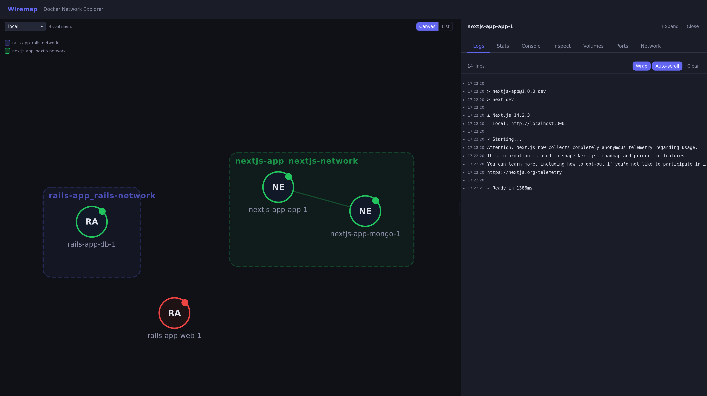

# Wiremap

Visual Docker network topology explorer — single binary, zero dependencies.

[](LICENSE)


<p align="center">
  
</p>

## Quick start

```bash
curl -sSL https://raw.githubusercontent.com/codeofmario/wiremap/main/install.sh | sh
```

Open [http://localhost:7070](http://localhost:7070). That's it.

<details>
<summary>Other install options</summary>

**Docker:**
```bash
docker run -d -p 7070:7070 \
  -v /var/run/docker.sock:/var/run/docker.sock:ro \
  codeofmario/wiremap
```

**Docker Compose:**
```yaml
services:
  wiremap:
    image: codeofmario/wiremap
    ports: ["7070:7070"]
    volumes:
      - /var/run/docker.sock:/var/run/docker.sock:ro
    restart: unless-stopped
```

**From source:**
```bash
git clone https://github.com/codeofmario/wiremap.git
cd wiremap && make build && ./bin/wiremap
```
</details>

## What you get

- **Topology map** — interactive graph of containers grouped by network
- **Logs & stats** — live streaming logs and CPU/memory/network charts
- **Console** — interactive shell into any container
- **File browser** — navigate and edit container files in the UI
- **Inspect & edit** — env vars, ports, volumes, labels — edit and apply
- **Multi-host** — connect to multiple Docker daemons (socket, TCP, TLS, SSH)

## Multi-host

Pass `--host` flags or use a config file:

```bash
wiremap --host unix:///var/run/docker.sock --host tcp://prod:2375
```

See [docs/configuration.md](docs/configuration.md) for TLS, SSH, and config file format.

## Docs

- [Configuration](docs/configuration.md) — hosts, TLS, SSH
- [API](docs/api.md) — REST + WebSocket reference
- [Development](docs/development.md) — building, architecture, contributing

## License

[MIT](LICENSE)
