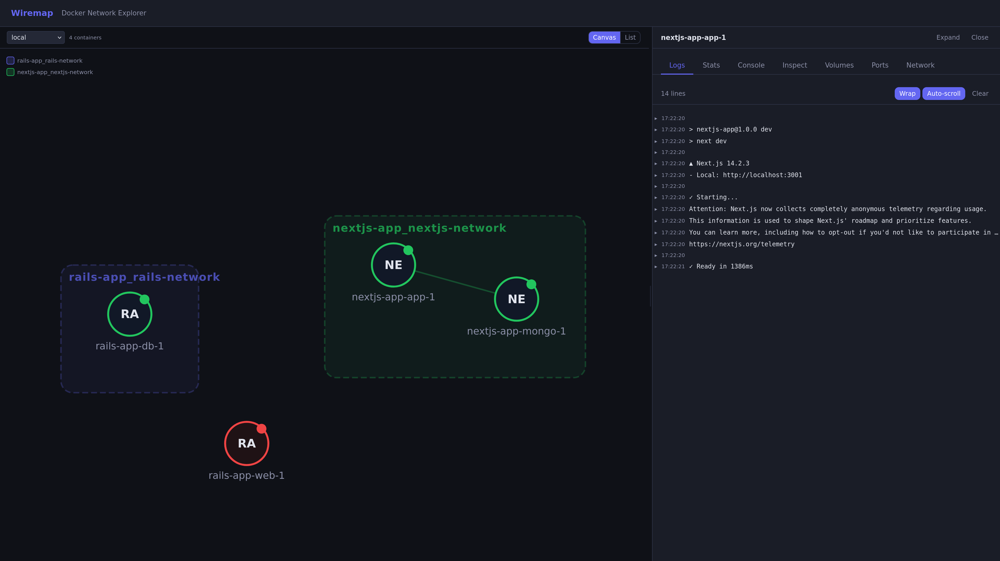
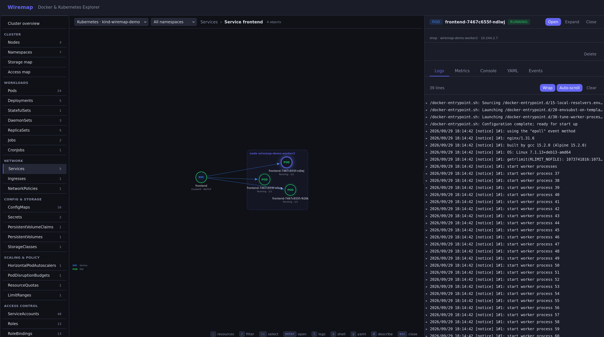

# Wiremap

See your Docker containers and Kubernetes clusters as a live map — in your browser, from a single binary.

[](LICENSE)


<p align="center">
  
  <br /><em>Docker — containers grouped by network</em>
</p>

<p align="center">
  
  <br /><em>Kubernetes — a Service and its pods, with live logs</em>
</p>

## Install

```bash
curl -sSL https://raw.githubusercontent.com/codeofmario/wiremap/main/install.sh | sh
wiremap
```

Then open [http://localhost:7070](http://localhost:7070).

<details>
<summary>Other ways to install</summary>

**Docker**

```bash
docker run -d -p 7070:7070 \
  -v /var/run/docker.sock:/var/run/docker.sock:ro \
  codeofmario/wiremap
```

**Docker Compose**

```yaml
services:
  wiremap:
    image: codeofmario/wiremap
    ports: ["7070:7070"]
    volumes:
      - /var/run/docker.sock:/var/run/docker.sock:ro
    restart: unless-stopped
```

**From source**

```bash
git clone https://github.com/codeofmario/wiremap.git
cd wiremap && make build && ./bin/wiremap
```
</details>

## Docker

Wiremap connects to your local Docker automatically. For each container you can:

- see it on a map, grouped by network
- follow its logs and CPU, memory and network usage
- open a shell in it
- browse and edit its files
- view and change its environment variables, ports, volumes and labels

To connect to more Docker hosts (TCP, TLS or SSH):

```bash
wiremap --host unix:///var/run/docker.sock --host tcp://prod:2375
```

## Kubernetes

Give Wiremap a kubeconfig, then pick the cluster in the top bar:

```bash
wiremap --kubeconfig ~/.kube/config                  # current context
wiremap --kube-context prod --kube-context staging   # several contexts
```

**How to move around**

- **Sidebar** — pick what to show: a namespace overview, Nodes, Pods, Deployments, Services, ConfigMaps and every other kind, including custom resources. Each shows how many there are.
- **Double-click** (or `Enter`) to open something and see what's inside it:
  - Namespace → everything in it
  - Deployment, StatefulSet, DaemonSet, Job → its Pods
  - CronJob → its Jobs
  - Service → its Pods
  - Node → the Pods running on it
  - ConfigMap, Secret, volume claim → the Pods using it
  - Pod → its containers
  - Container → its logs
- **Click** anything to open the side panel: logs, metrics, shell, YAML and events.
- **Go back** with `Esc` or the breadcrumb at the top. The page URL always matches what you see, so you can share it.

From the side panel you can also edit YAML, scale, restart, delete, run a CronJob now, and cordon or drain a node.

**Keyboard shortcuts**

| Key | What it does |
|-----|--------------|
| `:` | Jump to a kind, e.g. `:pods`, `:deploy`, `:svc`, `:nodes`. Add a namespace to switch too: `:deploy kube-system`, or `all` |
| `/` | Filter by name |
| `↑` `↓` or `j` `k` | Select the next / previous item |
| `Enter` | Open the selected item |
| `Esc` | Close the side panel, then go back |
| `l` `s` `y` `d` | Logs, shell, YAML, details of the selected item |

Wiremap can only do what your kubeconfig user is allowed to do. To give it read-only access, see [permissions](docs/configuration.md#permissions).

### Try it on a local cluster

This creates a small 3-node cluster with [kind](https://kind.sigs.k8s.io) and a demo `shop` app to explore:

```bash
kind create cluster --config examples/kubernetes/kind.yaml
kubectl apply -f examples/kubernetes/demo-app.yaml
kubectl wait --for=condition=Established crd/featureflags.demo.wiremap.io
kubectl apply -f examples/kubernetes/demo-flags.yaml
wiremap --kube-context kind-wiremap-demo
```

When you're done: `kind delete cluster --name wiremap-demo`.

## Configuration

Everything can be set with flags or a `wiremap.yml` file — Docker hosts, TLS, SSH, Kubernetes clusters and the port. See [docs/configuration.md](docs/configuration.md).

## Docs

- [Configuration](docs/configuration.md) — Docker hosts, Kubernetes clusters, permissions, flags
- [API](docs/api.md) — REST and WebSocket reference
- [Development](docs/development.md) — build, test and contribute

## License

[MIT](LICENSE)
